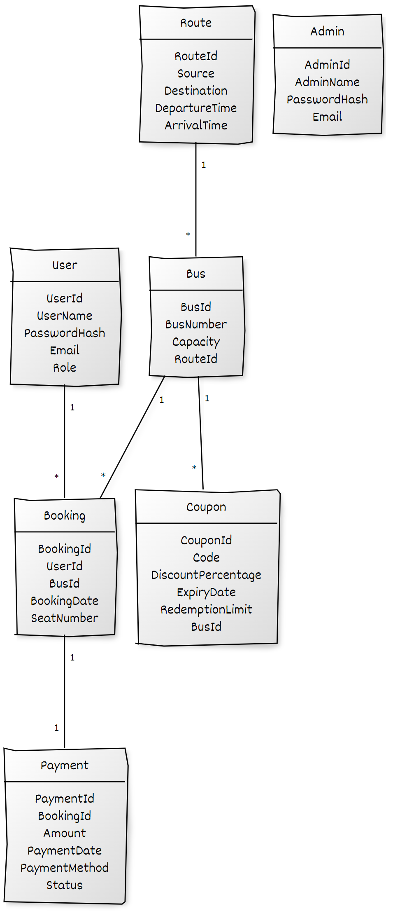

# .NET Implementation Plan for Bus Booking System

## Project Structure

1. **Models**
2. **DTOs (Data Transfer Objects)**
3. **Repositories**
4. **Services**
5. **Controllers**
6. **Authentication and Authorization**
7. **Exceptions**

## DTOs (Data Transfer Objects)

1. **UserDTO**
2. **AdminDTO**
3. **BusDTO**
4. **RouteDTO**
5. **BookingDTO**
6. **PaymentDTO**
7. **CouponDTO**

## Repositories

- Interfaces and implementations for data access.

1. **IUserRepository**
2. **IAdminRepository**
3. **IBusRepository**
4. **IRouteRepository**
5. **IBookingRepository**
6. **IPaymentRepository**
7. **ICouponRepository**

## Services

- Business logic handling.

1. **UserService**
2. **AdminService**
3. **BusService**
4. **RouteService**
5. **BookingService**
6. **PaymentService**
7. **CouponService**

## Controllers

- Handle API requests.

1. **UserController**
2. **AdminController**
3. **BusController**
4. **RouteController**
5. **BookingController**
6. **PaymentController**
7. **CouponController**

## Authentication and Authorization

1. **JWT Authentication**
2. **Role-based Authorization**

## Database Configuration

1. **DbContext**
2. **Entity Framework Core**
3. **Migrations**

## Implementation Plan

1. **Create Models**: Define models and their relationships in `DbContext`.
2. **Configure DTOs**: Set up DTOs for data transfer.
3. **Implement Repositories**: Create repository interfaces and implementations.
4. **Develop Services**: Implement business logic in services.
5. **Create Controllers**: Develop controllers to handle API requests.
6. **Set up Authentication and Authorization**: Implement JWT and role-based authorization.
7. **Configure Database**: Set up Entity Framework Core, configure `DbContext`, and run migrations.
8. **Test**: Write unit and integration tests. Include Sonar Cloud to check the code quality.
9. **Document**: Provide documentation for API endpoints, authentication, and deployment.
10. **Deploy**: Dockerize the project and deploy on Azure set CI/CD with github actions.

